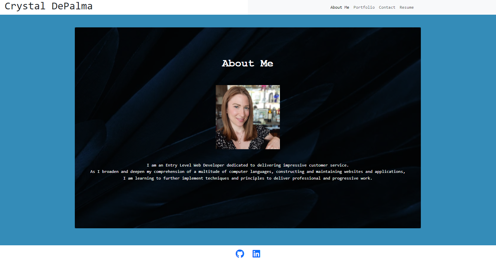

# myReactPortfolio

A Netlify deployed React application to showcase my work with fellow developers, alike, to collaborate on future projects.  

  ## Screenshot
  

  ## Description
  Here, I've a portfolio to showcase my projects, resume and experience via React/Vite using my new react skills to set me apart from other portfolios.

  ## Table of Contents
  - [Installation](#installation)
  - [Usage](#usage)
  - [Licence](#license)
  - [Contributing](#contributing)
  - [Tests](#tests)
  - [Questions](#questions)
  
  ## Installation
  ``` bash
  npm i  
  
  npm run dev
  ```
  
  ## Usage
 This mobile-first design application uses both inline CSS as well as Bootstrap for styling.


  ## License
    This project is licenced under the MIT license.
  [license](https://opensource.org/licenses/MIT)


  ## Tests
  No test

  ## Questions
  If you have any questions I may or comments, be contacted at [GitHub](cdepalma32), or by [email](crystaldepalma@yahoo.com).

